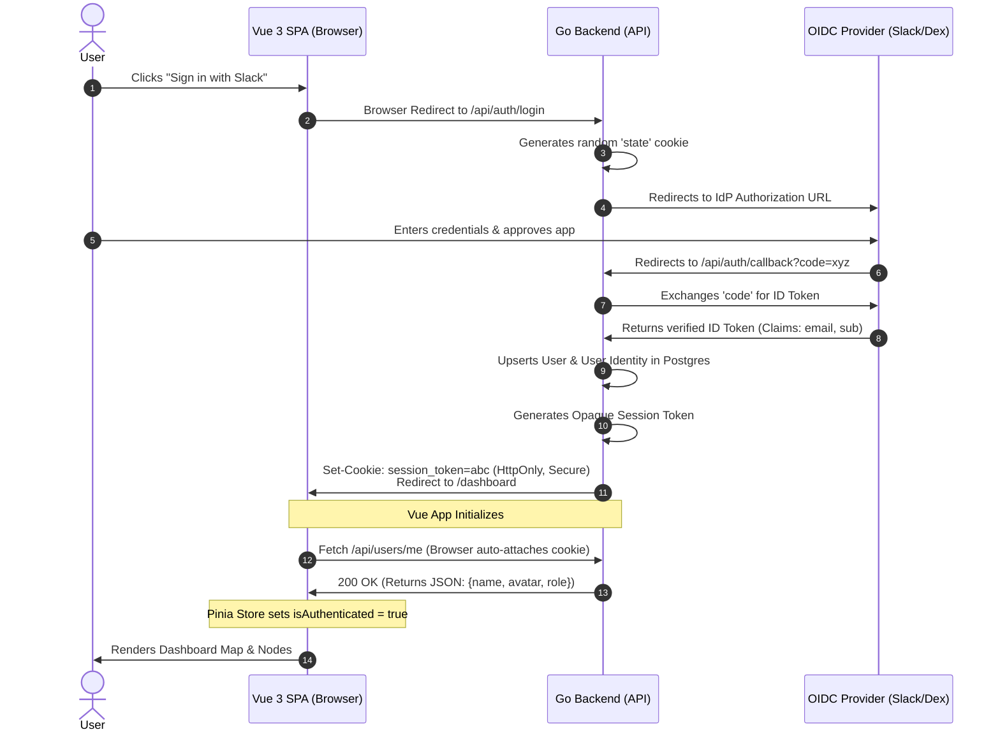

# BubblePulse Authentication Strategy

BubblePulse uses OpenID Connect (OIDC) as its sole authentication mechanism. To prioritize a frictionless user experience and reduce administrative overhead, BubblePulse acts as an OIDC Service Provider and delegates identity management to external Identity Providers (IdPs).

## Why OIDC?
We utilize the `github.com/coreos/go-oidc/v3/oidc` library, which automatically discovers OAuth2 endpoints using the provider's `/.well-known/openid-configuration`. This means BubblePulse does not need custom logic for Google, Okta, or LDAP. As long as your IdP speaks standard OIDC, BubblePulse can authenticate against it.

## The Login Flow
1. **Initiation (`/api/auth/login`):** BubblePulse generates a random `state` parameter (stored in an HTTP-only cookie) and redirects the user to the IdP's authorization endpoint.
2. **Authorization:** The IdP authenticates the user and redirects back to BubblePulse with an authorization `code`.
3. **Callback & Verification (`/api/auth/callback`):** 
    * BubblePulse verifies the `state` parameter to prevent CSRF attacks.
    * The `code` is exchanged for an OAuth2 token containing an `id_token` (a signed JWT).
    * BubblePulse uses the IdP's public keys (retrieved via discovery) to verify the `id_token` signature.
4. **Session Creation:** BubblePulse extracts the `sub` (subject identifier), `email`, and `name` from the verified token. If the user is new, they are automatically provisioned. An opaque session token is generated, stored in Postgres, and set as an HTTP-only cookie.

## Identity Brokering (Enterprise Setup)
By default, you can set BubblePulse's `OIDC_ISSUER_URL` directly to your preferred provider (e.g., Slack). 

If your organization uses multiple directories (e.g., Active Directory + Google Workspace) or requires SAML, **do not modify the BubblePulse Go code.** Instead, use an Identity Broker like [Dex](https://dexidp.io/) or [Zitadel](https://zitadel.com/):
1. Configure Dex/Zitadel to federate with your complex upstream directories.
2. Set BubblePulse's `OIDC_ISSUER_URL` to point to your Dex/Zitadel instance.

## Required Environment Variables
To start BubblePulse, you must provide the following:

```bash
OIDC_ISSUER_URL="[https://slack.com](https://slack.com)" # The base URL of your IdP
OIDC_CLIENT_ID="your_client_id"     # Provided by your IdP
OIDC_CLIENT_SECRET="your_secret"    # Provided by your IdP
OIDC_REDIRECT_URL="[https://bubblepulse.yourcompany.com/api/auth/callback](https://bubblepulse.yourcompany.com/api/auth/callback)"
```


