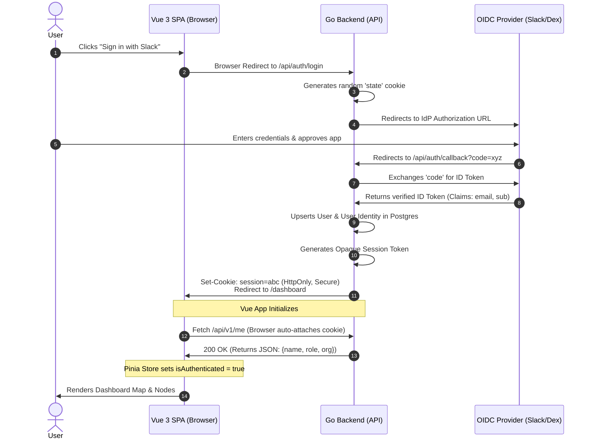
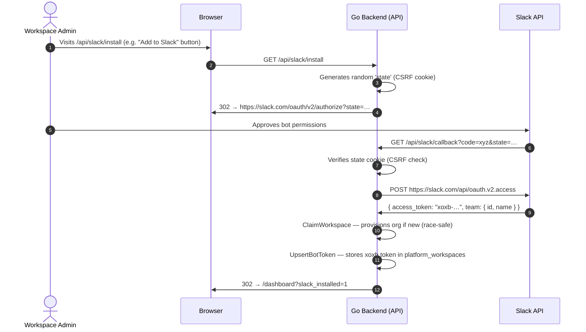

# BubblePulse Authentication Strategy

BubblePulse uses OpenID Connect (OIDC) as its sole **user** authentication mechanism, and a separate Slack OAuth v2 flow to authorize the **bot** in each workspace. These are two distinct flows that serve different purposes.

## Why OIDC?
We utilize the `github.com/coreos/go-oidc/v3/oidc` library, which automatically discovers OAuth2 endpoints using the provider's `/.well-known/openid-configuration`. This means BubblePulse does not need custom logic for Google, Okta, or LDAP. As long as your IdP speaks standard OIDC, BubblePulse can authenticate against it.

## The Login Flow (User Sign-In)

1. **Initiation (`/api/auth/login`):** BubblePulse generates a random `state` parameter (stored in an HTTP-only cookie) and redirects the user to the IdP's authorization endpoint.
2. **Authorization:** The IdP authenticates the user and redirects back to BubblePulse with an authorization `code`.
3. **Callback & Verification (`/api/auth/callback`):**
    * BubblePulse verifies the `state` parameter to prevent CSRF attacks.
    * The `code` is exchanged for an OAuth2 token containing an `id_token` (a signed JWT).
    * BubblePulse uses the IdP's public keys (retrieved via discovery) to verify the `id_token` signature.
4. **Session Creation:** BubblePulse extracts the `sub` (subject identifier), `email`, and `name` from the verified token. If the user is new, they are automatically provisioned. An opaque session token is generated, stored in Postgres, and set as an HTTP-only cookie.



## Slack Bot Installation (OAuth v2)

This is a **separate flow** from user sign-in. The OIDC flow tells BubblePulse *who the user is*. The install flow tells Slack *which workspaces the bot is authorized to operate in* and gives BubblePulse a workspace-scoped bot token (`xoxb-…`) for making outbound Slack API calls.

Both flows must complete for a workspace to be fully operational:
- **OIDC login** provisions the user account and creates the org↔workspace mapping.
- **Bot installation** stores the per-workspace bot token so BubblePulse can post messages back to Slack.

The incoming webhook (receiving DMs) uses the **signing secret** to verify requests — this is per-app and does not require the install flow. The bot token is only needed for outbound Slack API calls.

**Siloed (single-tenant) mode:** The install flow is optional. Set `SLACK_BOT_TOKEN` in `.env` as a fallback. Outbound calls will use this value when no per-workspace token is found in the database.

**Pooled (multi-tenant) mode:** Each workspace installs the app independently via the OAuth flow. Tokens are stored per-workspace in `platform_workspaces.bot_token`. `SLACK_BOT_TOKEN` has no effect.

### Required Environment Variables (pooled mode)

```bash
SLACK_CLIENT_ID="your_app_client_id"          # From api.slack.com/apps → OAuth & Permissions
SLACK_CLIENT_SECRET="your_app_client_secret"
SLACK_INSTALL_REDIRECT_URL="https://bubblepulse.yourcompany.com/api/slack/callback"
SLACK_SIGNING_SECRET="your_signing_secret"    # From Basic Information → App Credentials
```

### Install Flow



## Identity Brokering (Enterprise Setup)

By default, you can set BubblePulse's `OIDC_ISSUER_URL` directly to your preferred provider (e.g., Slack).

If your organization uses multiple directories (e.g., Active Directory + Google Workspace) or requires SAML, **do not modify the BubblePulse Go code.** Instead, use an Identity Broker like [Dex](https://dexidp.io/) or [Zitadel](https://zitadel.com/):
1. Configure Dex/Zitadel to federate with your complex upstream directories.
2. Set BubblePulse's `OIDC_ISSUER_URL` to point to your Dex/Zitadel instance.

> For a step-by-step guide on configuring all of this in the Slack API console, including Event Subscriptions and the bot install flow, see [docs/slack-setup.md](docs/slack-setup.md).

## Required Environment Variables (OIDC login)

```bash
OIDC_ISSUER_URL="https://slack.com"           # The base URL of your IdP
OIDC_CLIENT_ID="your_client_id"               # Provided by your IdP
OIDC_CLIENT_SECRET="your_secret"              # Provided by your IdP
OIDC_REDIRECT_URL="https://bubblepulse.yourcompany.com/api/auth/callback"
```
